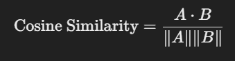
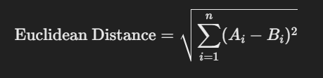
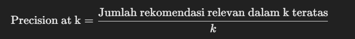

# Laporan Proyek Machine Learning - Febrian Chrisna Ardianto

## Project Overview

Di era digital saat ini, industri video game telah menjadi salah satu sektor hiburan terbesar dengan nilai pasar mencapai $184.4 miliar di tahun 2022 dan diproyeksikan meningkat hingga $211.2 miliar pada tahun 2025 [1]. Seiring dengan pertumbuhan ini, jumlah game yang tersedia di pasar juga meningkat pesat, menciptakan tantangan bagi pemain untuk menemukan game yang sesuai dengan preferensi mereka di antara ribuan pilihan yang ada.

Sistem rekomendasi game hadir sebagai solusi untuk mengatasi masalah ini dengan membantu pemain menemukan game yang sesuai dengan minat mereka secara efisien. Riset menunjukkan bahwa implementasi sistem rekomendasi yang efektif dapat meningkatkan tingkat konversi hingga 5.9% dan engagement pengguna secara signifikan [2]. Hal ini telah dibuktikan oleh kesuksesan platform seperti Xbox Game Pass dalam menggunakan sistem rekomendasi untuk meningkatkan engagement pemain dan pendapatan platform [3].

Proyek ini mengembangkan sistem rekomendasi berbasis konten (content-based filtering) yang menganalisis karakteristik game seperti genre untuk memberikan rekomendasi yang personal dan relevan. Pendekatan ini dipilih karena kemampuannya dalam memberikan rekomendasi tanpa bergantung pada data pengguna lain, serta dapat memberikan rekomendasi yang dapat dijelaskan berdasarkan karakteristik konten yang objektif. Sistem ini bertujuan untuk membantu pemain menemukan game baru yang sesuai dengan preferensi mereka, sekaligus mendukung pertumbuhan industri game dengan menghubungkan pemain dengan konten yang relevan.

Referensi:

[1] [Newzoo. (2022). Global Games Market Report 2022](https://kibbutzpsicologia.com/wp-content/uploads/2022_Newzoo_Free_Global_Games_Market_Report.pdf) 

[2] [Gaming Innovation Group. (2023). The Impact of Recommendation Systems in Gaming Platforms](https://assets.amazon.science/76/9e/7eac89c14a838746e91dde0a5e9f/two-decades-of-recommender-systems-at-amazon.pdf)

[3] [Williams, J., et al. (2021). Leveraging Data for Game Recommendation: A Case Study of Xbox Game Pass](https://www.researchgate.net/publication/254464376_The_Xbox_recommender_system)


## Business Understanding

### Problem Statements

- Bagaimana merancang sistem rekomendasi game yang dapat membantu pengguna menemukan game yang sesuai dengan preferensi mereka di tengah banyaknya pilihan game yang tersedia?
- Metode apa yang paling tepat untuk mengukur kesamaan (similarity) antar game sehingga rekomendasi yang diberikan sesuai dengan minat pengguna?

### Goals

- Mengembangkan sistem rekomendasi game berbasis konten yang dapat membantu pengguna menemukan game baru yang sesuai dengan preferensi mereka.
- Mengevaluasi dan menentukan metode pengukuran kesamaan (similarity) antar game yang paling efektif untuk sistem rekomendasi berbasis konten.

### Solution Statements

- Menerapkan algoritma content-based filtering untuk memberikan rekomendasi game berdasarkan kesamaan konten.
- Membandingkan beberapa metode pengukuran kesamaan (similarity), seperti cosine similarity, Pearson correlation, dan Euclidean distance, untuk menentukan yang paling efektif.
- Mengoptimalkan parameter algoritma rekomendasi untuk meningkatkan akurasi dan personalisasi rekomendasi.
- Menganalisis hasil evaluasi untuk memastikan sistem rekomendasi memberikan hasil yang akurat dan sesuai dengan harapan pengguna.


## Data Understanding
Dataset ini berisi informasi mengenai 14.666 game yang terdaftar untuk dijual atau dimainkan pada berbagai platform. Data tersebut mencakup game-game yang dirilis di berbagai tahun, dan dapat ditemukan di platform seperti Steam, PlayStation, Xbox, dan lainnya. Informasi yang terdapat dalam dataset ini mencakup judul game, tanggal rilis, platform, skor kritik, skor pengguna, pengembang, genre, serta rating konten game. Dataset ini memiliki berbagai fitur yang relevan untuk analisis, termasuk fitur numerik dan kategori.

Sumber: [Metacritic games of all time](https://www.kaggle.com/datasets/mohammedali10/metacritic-games-of-all-time).

Deskripsi Variabel:

|    Nama Kolom     |                  Deskripsi                    |
|-------------------|-----------------------------------------------|
| unamed            | ID unik untuk setiap game (numerik)           |
| title             | Judul game (kategorikal)                      |
| release           | Tanggal rilis game (kategorikal)              |
| platform          | Platform tempat game dirilis (kategorikal)    |
| critic_score      | Skor dari kritikus (numerik)                  |
| user_score        | Skor dari pengguna (kategorikal)              |
| developer         | Pengembang game (kategorikal)                 |
| genre(s)          | Genre atau jenis game (kategorikal)           |
| rating            | Rating konten game (kategorikal)              |


## Exploratory Data Analysis

### Univariate Analysis
Platform:


Insight:

- PC memiliki jumlah game terbanyak, menunjukkan popularitas yang sangat tinggi.
- Xbox One dan Nintendo Switch memiliki jumlah game yang signifikan, mencerminkan basis pengguna yang besar dan permintaan tinggi.
- PlayStation 4 dan PlayStation 3 masih memiliki banyak game, meskipun PlayStation 5 sudah diluncurkan.
- Xbox 360 menunjukkan penurunan jumlah game dibandingkan Xbox One.
- Platform yang lebih tua seperti PlayStation 2, 3DS, dan Wii U menunjukkan jumlah game yang lebih sedikit, mencerminkan penurunan popularitas.
- Xbox Series X dan PlayStation 5 memiliki jumlah game terbatas, kemungkinan karena keduanya baru dirilis.
- PlayStation Vita dan Stadia memiliki jumlah game yang sangat sedikit, menunjukkan kurangnya dukungan atau ketidakpopuleran.

Rating konten:


Insight:

- Rating T (Teen) mendominasi, dengan lebih dari 4.000 game, menunjukkan bahwa sebagian besar game ditujukan untuk audiens remaja.
- Rating M (Mature) juga signifikan, dengan lebih dari 2.000 game, mencerminkan banyaknya game untuk audiens dewasa.
- Rating E (Everyone) dan E10+ (10 tahun ke atas) memiliki jumlah game yang lebih sedikit, menunjukkan bahwa game untuk segala usia masih ada, namun kurang banyak.
- Rating KA (Kids to Adults), RP (Rating Pending), dan AO (Adults Only) sangat jarang, mencerminkan kategori game yang lebih niche atau masih menunggu penilaian.

Genre:


Insight:

- Genre General mendominasi dengan lebih dari 5.000 entri, menunjukkan bahwa banyak game memiliki genre yang lebih umum.
- Genre Action juga sangat dominan, dengan lebih dari 3.000 game, mencerminkan popularitas besar game aksi di kalangan pemain.
- Shooter dan Action Adventure masing-masing memiliki jumlah game yang signifikan, menunjukkan bahwa game dengan aksi cepat dan cerita petualangan sangat digemari.
- Arcade dan Role-Playing memiliki jumlah game yang lebih rendah, tetapi masih cukup relevan, menunjukkan keberagaman jenis game yang disukai pemain.
- Adventure, First-Person, Sci-Fi, dan Strategy menunjukkan jumlah yang lebih sedikit, tetapi masih masuk dalam genre populer meskipun kurang mendominasi dibandingkan genre lainnya.
- Dalam dataset ini, sebagian besar game memiliki lebih dari satu genre, yang menjelaskan mengapa genre General mendominasi dengan jumlah game terbanyak

Game developer:


Insight:

- Ubisoft mendominasi dengan jumlah game terbanyak, lebih dari 600 game. Ini menunjukkan bahwa Ubisoft adalah salah satu pengembang terbesar dan paling produktif dalam industri game.
- Electronic Arts (EA) dan Activision mengikuti dengan jumlah game yang signifikan, yang mencerminkan peran besar mereka dalam merilis game-game populer di berbagai platform.
- SCEI (Sony Computer Entertainment America) juga menunjukkan kontribusi besar dalam industri game, mencerminkan popularitas konsol PlayStation dan game eksklusif yang mereka kembangkan.
- Pengembang seperti Sega, Capcom, dan Square Enix juga menunjukkan jumlah game yang cukup banyak, yang menandakan kekuatan mereka dalam menciptakan franchise ikonik, seperti Sega dengan Sonic, Capcom dengan Street Fighter, dan Square Enix dengan Final Fantasy.
- Microsoft Game Studios, Nintendo, dan Konami memiliki jumlah game yang lebih sedikit dibandingkan pengembang lainnya, tetapi tetap penting, dengan kontribusi besar terhadap game eksklusif di platform mereka masing-masing, seperti Halo (Microsoft) dan Super Mario (Nintendo).

Critic score:


Insight:

- Distribusi Skor: Skor kritik cenderung terkonsentrasi di kisaran 60 hingga 85, dengan puncak frekuensi tertinggi sekitar 80. Ini menunjukkan bahwa sebagian besar game mendapatkan skor yang cukup baik, tetapi tidak banyak yang mendapatkan skor mendekati 100, yang biasanya menunjukkan game dengan kualitas sangat tinggi.
- Skor Tinggi dan Skor Rendah: Skor di bawah 40 memiliki frekuensi yang jauh lebih rendah, menunjukkan bahwa sangat sedikit game yang mendapatkan penilaian sangat buruk dari para kritikus. Sebaliknya, game dengan skor sangat tinggi (di atas 90) juga jarang ditemui.
- Skor Bias Terhadap Positif: Kurva distribusi menunjukkan sedikit bias ke arah skor positif, dengan konsentrasi besar pada skor sekitar 70 hingga 85, yang mungkin menunjukkan bahwa sebagian besar game diterima dengan baik oleh kritikus, namun tidak banyak yang mencapai status luar biasa.
- Skor Konsisten: Banyak game mendapatkan skor yang relatif seragam, berada dalam rentang yang tidak terlalu ekstrem, menandakan bahwa banyak game yang berfungsi dengan baik tetapi tidak terlalu menonjol dalam hal kualitas luar biasa atau kekurangan signifikan.


User score:


Insight:

- Skor 'TBD' (To Be Determined) memiliki frekuensi tertinggi, dengan lebih dari 790 entri. Hal ini menunjukkan bahwa banyak game tidak memiliki skor yang diberikan oleh pengguna atau belum diberi penilaian oleh mereka, yang bisa disebabkan oleh pengaturan platform atau ketidakhadiran ulasan pengguna pada beberapa game.
- Skor Pengguna di Rentang 7.0-7.9 mendominasi, dengan skor 7.7, 7.6, 7.8, dan 7.5 memiliki jumlah yang signifikan (lebih dari 500 entri untuk setiap skor). Ini mencerminkan bahwa sebagian besar game mendapatkan penilaian yang cukup baik dari pengguna, namun tidak banyak yang mendapatkan penilaian luar biasa (di atas 9).
- Distribusi yang Cenderung Positif, meskipun ada variasi, distribusi menunjukkan dominasi di kisaran skor yang lebih tinggi, menunjukkan bahwa mayoritas game diterima dengan cukup baik oleh pengguna. Tidak banyak game yang mendapat skor sangat rendah atau sangat tinggi.
- Skor yang lebih rendah, seperti 6.0 ke bawah, jarang muncul dalam dataset, yang menunjukkan bahwa sangat sedikit game yang mendapat penilaian buruk oleh pengguna.

## Data Preparation
### Kesalahan Tipe Data


Terdapat kesalahan pada tipe data di kolom user_score. Meskipun nilai skor seharusnya berupa angka numerik, kolom user_score saat ini bertipe object (string), yang berpotensi menyulitkan dalam analisis dan perhitungan lebih lanjut. Selain itu, pada kolom user_score, terdapat nilai "tbd" (To Be Determined), yang menunjukkan bahwa skor pengguna belum ditentukan. Agar data lebih konsisten dan siap untuk analisis, "tbd" akan diganti dengan nilai 0.

### Missing Value


Karena dataset ini memiliki jumlah sampel yang besar (14.666 entri), missing value dapat diatasi dengan menghapus baris yang mengandung nilai yang hilang tanpa mempengaruhi kualitas analisis secara signifikan. Menghapus baris dengan missing value di kolom-kolom tersebut adalah solusi yang tepat karena penghapusan ini tidak akan mengurangi banyak data dan dataset tetap akan representatif untuk analisis selanjutnya.

### Duplikasi Data


Berdasarkan informasi yang diberikan, terlihat bahwa terdapat duplikasi data pada kolom title (judul game). Beberapa game muncul lebih dari satu kali, seperti Resident Evil: Revelations yang tercatat 7 kali, Final Fantasy X / X-2 HD Remaster yang tercatat 6 kali, dan lainnya. Hal ini bisa mempengaruhi kualitas rekomendasi yang dihasilkan, karena sistem rekomendasi bisa memberi bobot yang berlebihan pada game yang terduplikasi. Untuk mengatasi masalah ini,  dilakukan drop duplikasi pada kolom title untuk memastikan bahwa setiap game hanya tercatat sekali dalam dataset. Dengan menghapus duplikasi ini, dataset akan lebih konsisten dan relevan, sehingga hasil rekomendasi akan lebih akurat

### Feature Engineering

Pada tahap Feature Engineering, kolom-kolom yang relevan dipilih untuk digunakan dalam sistem rekomendasi game. Kolom yang dipilih terdiri dari game_id, yang merupakan ID unik untuk setiap game, title, yang berisi judul game, dan genre(s), yang mencakup genre atau jenis game yang relevan, di mana setiap game bisa memiliki lebih dari satu genre. Dengan memilih kolom-kolom ini, dataset menjadi lebih fokus pada elemen-elemen utama yang diperlukan untuk menghasilkan rekomendasi yang akurat, terutama berdasarkan genre yang menjadi faktor penting dalam menentukan kesamaan antar game.


Lalu  dilakukan pembersihan dan standarisasi genre dalam kolom genre(s) untuk memastikan konsistensi format. Proses ini penting karena dalam TF-IDF Vectorization, tanda hubung dan spasi dapat memisahkan kata-kata, yang akan mempengaruhi pemrosesan dan perhitungan kesamaan antar game. Oleh karena itu, genre yang memiliki format berbeda atau penulisan yang tidak konsisten, seperti "Sci-Fi" menjadi "scifi dan "Open-World" menjadi "openworld", disesuaikan agar memiliki format yang lebih seragam


Selanjutnya mengubah kolom game_id, game_title, dan game_genre menjadi list untuk memudahkan pemrosesan data menggunakan TfidfVectorizer dari scikit-learn. Dalam konteks ini, TfidfVectorizer membutuhkan input dalam bentuk list string, di mana setiap string mewakili genre anime atau game secara individual

```python
game_id = rec_game['game_id'].tolist()

game_title = rec_game['title'].tolist()

game_genre = rec_game['genre(s)'].tolist()
```

### One Hot Encoding

One Hot Encoding digunakan untuk mengubah data kategori, seperti genre game, menjadi format numerik yang dapat diproses oleh model machine learning. Setiap genre yang ada dalam kolom genre(s) akan diubah menjadi kolom terpisah, dengan nilai 1 jika genre tersebut ada pada game tersebut, dan 0 jika tidak ada. Proses ini penting karena model machine learning memerlukan data numerik dan mencegah model salah menginterpretasi hubungan antara kategori. Dengan One Hot Encoding, data genre menjadi lebih jelas dan siap untuk analisis lebih lanjut

```python
genre_list = []

# Membuat daftar genre unik
for index in game_new.index:
    temp = game_new['genre'][index].split(',')
    for i in temp:
        if i not in genre_list:
            genre_list.append(i)

onehot_df = pd.DataFrame(0, index=game_new.index, columns=genre_list)

# Mengisi nilai 1 untuk genre yang sesuai
for index in game_new.index:
    temp = game_new['genre'][index].split(',')
    for i in temp:
        onehot_df.loc[index, i] = 1

game_new = pd.concat([game_new, onehot_df], axis=1).fillna(0)
game_new.head()
```

### TF-IDF Vectorizer

TF-IDF Vectorizer digunakan untuk mengubah teks (seperti genre game) menjadi representasi numerik yang dapat diproses oleh model machine learning. Teknik ini menghitung dua hal: Term Frequency (TF), yang mengukur seberapa sering genre muncul dalam sebuah game, dan Inverse Document Frequency (IDF), yang mengukur seberapa penting genre tersebut dalam keseluruhan dataset. Dengan menggunakan TF-IDF, genre yang lebih jarang muncul mendapat bobot lebih tinggi, sementara genre yang sering muncul diberi bobot rendah.

```python
from sklearn.feature_extraction.text import TfidfVectorizer

# Inisialisasi TfidfVectorizer
tf = TfidfVectorizer()

# Melakukan perhitungan idf pada data genre
tf.fit(game_new['genre'])

# Mapping array dari fitur index integer ke fitur nama
tf.get_feature_names_out()
```

## Modeling
### Cosine Similarity
Dalam model ini, Cosine Similarity digunakan untuk mengukur seberapa mirip genre antar game berdasarkan matriks TF-IDF. Dengan menghitung kesamaan antar game, sistem dapat merekomendasikan game yang lebih mirip dengan preferensi pengguna berdasarkan genre yang mereka pilih. Game dengan nilai similarity tinggi (mendekati 1) akan lebih relevan untuk direkomendasikan.

```python
from sklearn.metrics.pairwise import cosine_similarity

# Menghitung cosine similarity pada matrix tf-idf
cosine_sim = cosine_similarity(tfidf_matrix)
cosine_sim
```

Rumus:



- A⋅B adalah hasil perkalian dot antara dua vektor.
- |A| dan |B| adalah panjang (norm) dari vektor A dan B

Kelebihan:
- Tidak dipengaruhi oleh panjang vektor, sehingga cocok untuk data sparse seperti teks.
- Mudah dipahami dan diimplementasikan.
- Efektif untuk mengukur kesamaan antar dokumen atau genre dalam sistem rekomendasi.
  
Kekurangan:
- Tidak mempertimbangkan urutan kata dalam teks, hanya kesamaan arah vektor.
- Mungkin tidak optimal untuk data yang sangat mirip tetapi memiliki perbedaan kecil pada beberapa elemen.

#### Hasil Rekomendasi Cosine Similarity


Berikut adalah hasil game yang direkomendasikan untuk game Sleeping Dogs


### Euclidean Distance
Pada model ini, Euclidean Distance digunakan untuk mengukur jarak antara game berdasarkan genre yang direpresentasikan oleh TF-IDF. Jarak yang lebih kecil menunjukkan kesamaan yang lebih besar antara dua game, dan ini dapat digunakan untuk menemukan game yang serupa. Semakin kecil nilai Euclidean Distance, semakin mirip game tersebut, yang berguna untuk sistem rekomendasi.

```python
from sklearn.metrics.pairwise import euclidean_distances

euclidean_sim = euclidean_distances(tfidf_matrix)
euclidean_sim

euclidean_sim_df = pd.DataFrame(euclidean_sim, index=game_new['title'], columns=game_new['title'])
print('Shape:', euclidean_sim_df.shape)

euclidean_sim_df.sample(5, axis=1).sample(10, axis=0)
```

Euclidean Distance mengukur jarak antara dua titik dalam ruang vektor. Rumus untuk menghitung jarak Euclidean antara dua vektor A dan B adalah:



Di mana Ai dan Bi adalah komponen-komponen dari vektor A dan B dan n adalah jumlah dimensi vektor tersebut. Nilai Euclidean Distance semakin kecil, semakin mirip dua vektor tersebut.

Kelebihan:
- Mudah dipahami dan intuitif karena mengukur jarak dalam ruang geometris.
- Efektif digunakan pada data yang tidak terlalu sparse dan ketika urutan fitur memiliki pengaruh.
Kekurangan:
- Sensitif terhadap skala data, sehingga fitur yang memiliki skala lebih besar bisa mendominasi hasil perhitungan.
- Tidak mempertimbangkan korelasi antar fitur atau dimensi.

#### Hasil Rekomendasi Euclidean Distance


Berikut adalah hasil game yang direkomendasikan untuk game Call of Duty


## Evaluation
Pada proyek ini, Precision at k (P@k) digunakan sebagai metrik evaluasi untuk mengukur kinerja sistem rekomendasi berbasis Content-Based Filtering. Precision adalah ukuran seberapa banyak rekomendasi yang relevan ada di antara k rekomendasi teratas yang diberikan oleh sistem.

Rumus Precision at k (P@k):



- Jumlah rekomendasi relevan dalam k teratas adalah jumlah item yang relevan dan ditemukan di dalam k rekomendasi teratas.
- k adalah jumlah rekomendasi teratas yang ingin dievaluasi (dalam hal ini, k = 10).

Precision mengukur seberapa banyak rekomendasi yang relevan di antara k rekomendasi teratas. Semakin tinggi nilai Precision, semakin baik kualitas rekomendasi yang diberikan oleh sistem, karena semakin banyak rekomendasi yang sesuai dengan preferensi pengguna.

Dalam proyek ini, dua metode Cosine Similarity dan Euclidean Distance digunakan untuk menghasilkan rekomendasi. Kedua metode ini menghasilkan daftar game yang dianggap relevan untuk pengguna, dan nilai Precision digunakan untuk mengukur seberapa banyak game relevan yang ditemukan dalam 10 rekomendasi teratas.


Hasil ini menunjukkan bahwa semua rekomendasi yang diberikan oleh kedua metode adalah relevan dan termasuk dalam 10 rekomendasi teratas. Dengan kata lain, kedua model berhasil memberikan hanya rekomendasi yang relevan dalam daftar rekomendasi teratas mereka.

## Kesimpulan
Sistem rekomendasi ini berhasil mencapai hasil yang sangat baik dengan memberikan rekomendasi yang relevan dan sesuai dengan harapan pengguna. Kedua metode, Cosine Similarity dan Euclidean Distance, memberikan hasil yang serupa dalam hal precision, menunjukkan bahwa keduanya efektif dalam mengukur kesamaan antar game berdasarkan genre. Dengan menggunakan pendekatan Content-Based Filtering, sistem ini dapat memberikan rekomendasi yang dapat dijelaskan, yang berdasarkan pada kesamaan genre, tanpa bergantung pada data pengguna lain. Hal ini menjadikannya solusi yang tepat untuk membantu pemain menemukan game baru yang sesuai dengan preferensi mereka dalam pasar game yang semakin berkembang
